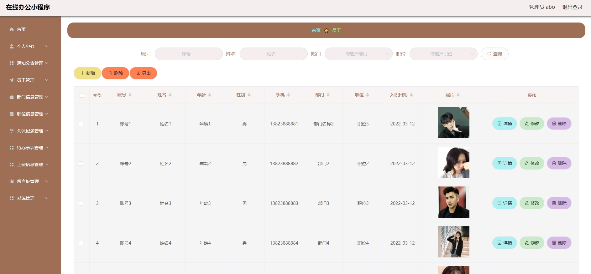
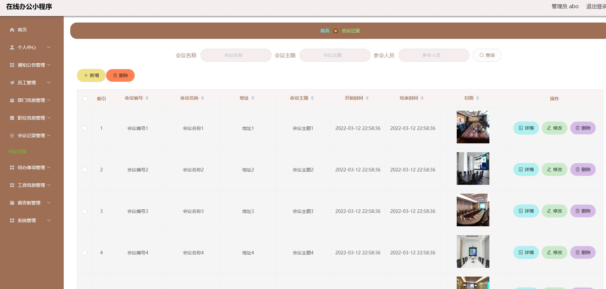
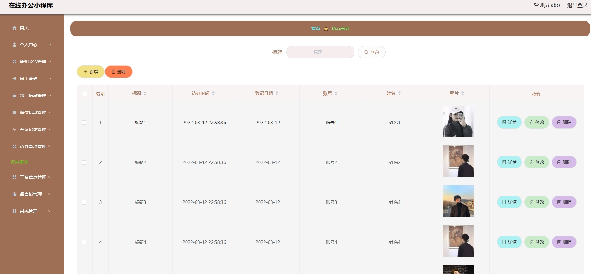
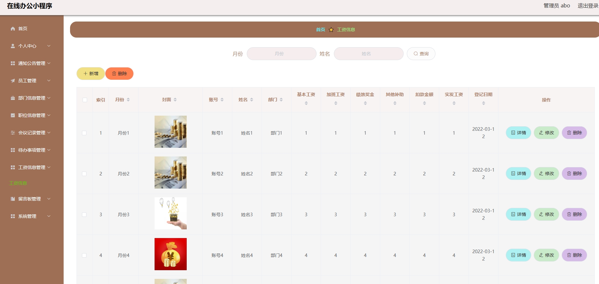
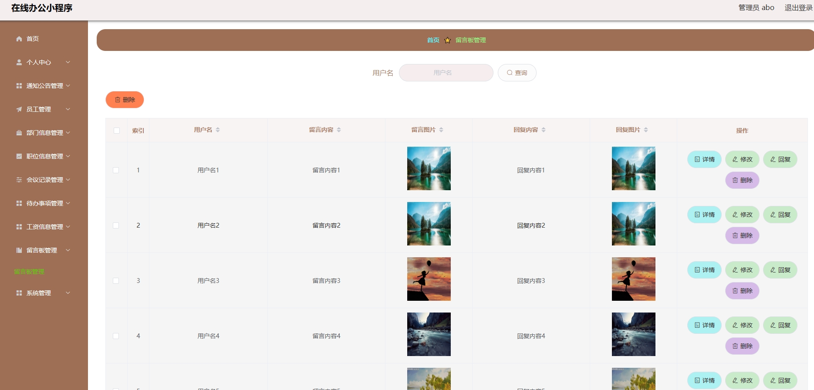
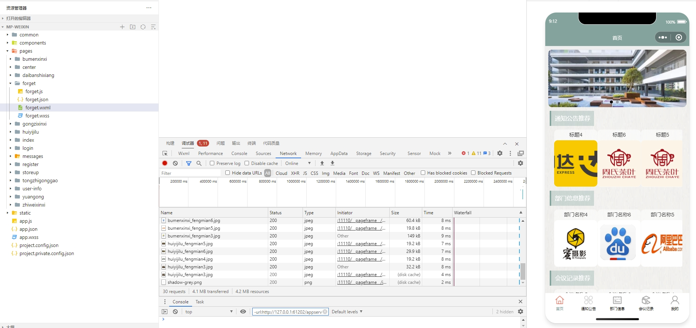
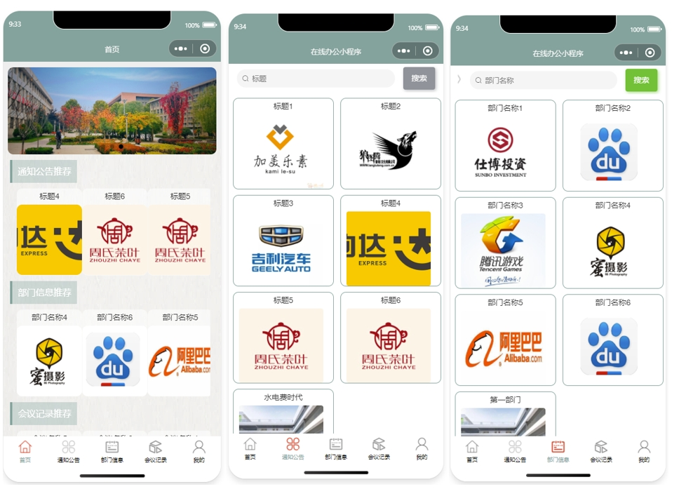
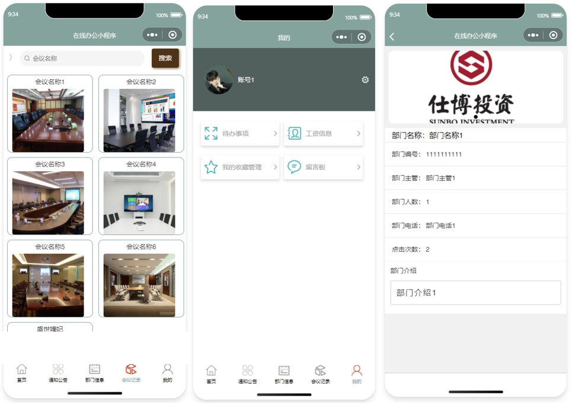
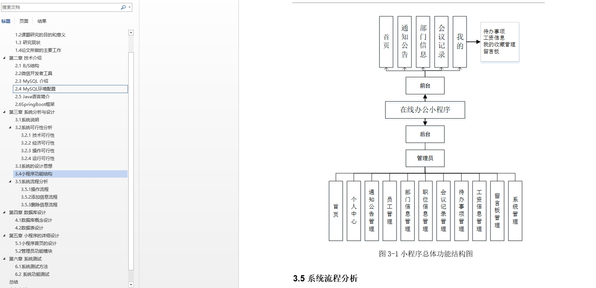

# 1.项目介绍
- 系统角色：管理员、普通用户
- 功能模块：员工管理、部门信息管理、职位信息管理、会议记录、待办事项、工资信息、留言板等
- 技术选型：SpringBoot，Vue（后端管理web），uniapp等
- 测试环境：idea2024，jdk1.8，mysql5.7，maven3，tomcat8，HbuilderX，微信开发工具
# 2.项目部署
## 2.1 后端部署
- 创建数据库，导入sql文件
- idea打开项目，根据本地数据库环境修改src/main/resources/application.yml 11-14行
- 启动项目，src/main/java/com/SpringbootSchemaApplication.java
- http://localhost:8080/springbootia505/admin/dist/index.html   管理员账号密码：abo/abo， 其他自行查表
- 说明：vue项目是src/main/webapp/admin，上面的链接是直接运行了编译后的文件，如果你要对页面做一些修改，可以通过vscode或者webstorm去打开vue项目进行修改
## 2.2 小程序部署
- 通过微信开发工具，打开项目mp-weixin
- appid配置为你自己小程序的，或者你自己申请的测试小程序appid
- 信任项目即可，如果页面空白，重新编译下
- 说明：mp-weixin是uniapp项目编译后的，如果你想对小程序做一些修改，你可以通过HbuilderX打开src/main/resources/front，这个是uniapp项目
# 3.项目部分截图

# 4.获取方式
[戳我查看](https://gitee.com/aven999/mall)
